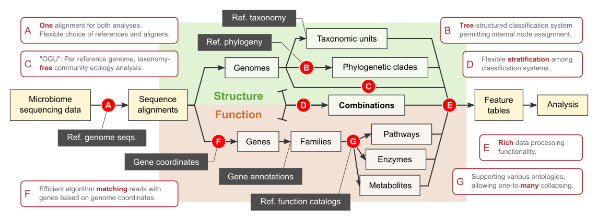
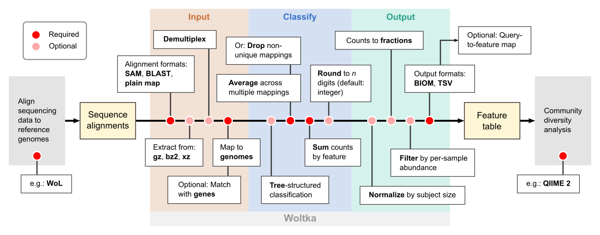

# Woltka

[](https://opensource.org/licenses/BSD-3-Clause)
[](https://github.com/qiyunzhu/woltka/actions)
[](https://coveralls.io/github/qiyunzhu/woltka?branch=master)


**Woltka** is a versatile program for determining the structure and functional capacity of microbiomes. It mainly works with shotgun metagenomic data. It bridges first-pass sequence aligners with advanced analytical platforms (such as QIIME 2). It takes full advantage of, and is not limited by, the [WoL](https://biocore.github.io/wol/) reference database. Its scope and highlights are:



Woltka ships with a **QIIME 2 plugin**. [See here for instructions](woltka/q2).

## Contents

- [Overview](#overview)
- [Installation](#doc/install.md)
- [Example usage](#example-usage)
- Tutorials
  - [Working with WoL](doc/wol.md)
  - [The OGU analysis](doc/ogu.md)
- Main workflow
  - [Input files](doc/input.md), [Output files](doc/output.md), [Sequence alignment](doc/align.md), [Classification systems](doc/hierarchy.md), [Classification methods](doc/classify.md), [Coordinates matching](doc/ordinal.md), [Stratification](doc/stratify.md)
- Table utilities
  - [Collapse](doc/collapse.md), [Coverage](doc/coverage.md), [Normalize](doc/normalize.md), [Filter](doc/filter.md), [Merge](doc/merge.md)
- For users of
  - [QIIME 2](woltka/q2), [Qiita](doc/qiita.md), [Bowtie2](doc/align.md#alignment-with-bowtie2), [SHOGUN](doc/align.md#the-shogun-protocol), [RefSeq](doc/refseq.md), [GTDB](doc/gtdb.md), [MetaCyc](doc/metacyc.md), [KEGG](doc/kegg.md)
- References
  - [Command-line interface](doc/cli.md)
  - [Computational efficiency](doc/perform.md)
- [FAQs](#doc/faq.md)
- [Citation](#citation)
- [Contact](#contact)


## Overview

### Where does Woltka fit in a pipeline

Woltka is a **classifier**. It fits in between sequence alignment and microbiome analyses.

### What does Woltka do

Woltka processes [**alignments**](doc/input.md) -- the mappings of microbiome sequencing data against reference sequences (such as genomes or genes), and [infers the best placement](doc/classify.md) of the queries in a hierarchical [classification system](doc/hierarchy.md). One query could have simultaneous matches in multiple references. Woltka finds the most suitable classification unit(s) to describe the query accordingly the criteria specified by the user. Woltka generates [**profiles**](doc/output.md) (feature tables) -- the abundances of classification units which describe the structure or function of microbial communities.

### What else does Woltka do

Woltka provides several utilities for handling feature tables, including [normalizing](doc/normalize.md) data, [collapsing](doc/collapse.md) a table to higher-level features, calculating feature group [coverage](doc/coverage.md), [filtering](doc/filter.md) features based on per-sample abundance, and [merging](doc/merge.md) tables.

### What does Woltka not do

Woltka does NOT **align** sequences. You need to align your sequencing data (FastQ, etc.) against a reference database (we recommend [WoL](wol.md)) using an aligner of your choice (e.g., [Bowtie2](doc/align.md#alignment-with-bowtie2)). The resulting alignment files can be fed into Woltka.

Woltka does NOT **analyze** profiles. We recommend using [QIIME 2](https://qiime2.org/) for robust downstream analyses of the profiles to decode the relationships among micobial communities and with their environments.

Flowchart of Woltka's main classification workflow:




## Installation

Requirement: [Python](https://www.python.org/) 3.6 or above.

```bash
pip install woltka
```

See more details about [installation](doc/install.md).


## Example usage

Woltka provides several small test datasets under [woltka/tests/data](woltka/tests/data). To access them, [download](https://github.com/qiyunzhu/woltka/archive/master.zip) this GitHub repo, unzip, and navigate to this directory.

One can execute the following commands to make sure that Woltka functions correctly, and to get an impression of the basic usage of Woltka.

(Note: a more complete list of commands is provided [here](woltka/tests/data). Alternatively, you can skip this test dataset and check out the [instruction](doc/wol.md) for working with WoL.)

### 1\. OGU (operational genomic unit) table generation ([details](doc/ogu.md)):

```bash
woltka classify -i align/bowtie2 -o ogu.biom
```

The input path, [`align/bowtie2`](woltka/tests/data/align/bowtie2), is a directory containing five Bowtie2 alignment files (`S01.sam.xz`, `S02.sam.xz`,... `S05.sam.xz`) (SAM format, xzipped), each representing the mapping of metagenomic sequencing reads per sample against a reference genome database (here are [guidlines](doc/align.md) for performing alignment).

The output file, `table.biom`, is a feature table in BIOM format, which can then be analyzed using various bioformatics programs such as [QIIME 2](https://qiime2.org/).

### 2\. Taxonomic profiling at the ranks of phylum, genus and species ([details](doc/hierarchy.md)):

```bash
woltka classify \
  --input  align/bowtie2 \
  --map    taxonomy/taxid.map \
  --nodes  taxonomy/nodes.dmp \
  --names  taxonomy/names.dmp \
  --rank   phylum,genus,species \
  --output output_dir
```

The mapping file (`taxid.map`) translates genome IDs to taxonomy IDs, which then allows Woltka to classify query sequences based on the NCBI taxonomy (`nodes.dmp` and `names.dmp`).

The output directory (`output_dir`) will contain three feature tables: `phylum.biom`, `genus.biom` and `species.biom`, each representing a taxonomic profile at one of the three ranks.

### 3\. Functional profiling by UniRef entries, then by GO molecular processes ([details](doc/ordinal.md)):

```bash
woltka classify \
  --input  align/bowtie2 \
  --coords function/coords.txt.xz \
  --map    function/uniref.map.xz \
  --map    function/go/process.tsv.xz \
  --rank   uniref,process \
  --output output_dir
```

Here, the input files are still **read-to-genome** alignments, rather than read-to-gene ones. Woltka matches reads with genes based on their coordinates on genomes using an efficient [algorithm](doc/ordinal.md). The gene coordinates are given by the database file `coords.txt` (see [details](doc/ordinal.md)). The read coordinates are extracted from the alignment files. This ensures consistency between structural and functional analyses.

Subsequently, Woltka is able to assign query sequences to functional units, as defined in mapping files (`uniref.map` and `go/process.tsv`). As you can see, compressed files are supported and auto-detected.

Similarly, the output files are two functional profiles: `uniref.biom` and `process.biom`.

### 4\. Combined taxonomic/functional profiling by GO molecular processes of individual genera of organisms ([details](doc/stratify.md)).

Two steps. _First_, perform taxonomic classification. The `--outmap` parameter writes a read-to-genus mapping file per sample to the directory `genus_map/`. The `--name-as-id` flag replaces NCBI TaxIDs with real taxon names in the output.

```bash
woltka classify \
  --input  align/bowtie2 \
  --map    taxonomy/taxid.map \
  --nodes  taxonomy/nodes.dmp \
  --names  taxonomy/names.dmp \
  --name-as-id \
  --rank   genus \
  --output genus.biom \
  --outmap genus_map
```

_Second_, perform functional classification. The `--stratify` parameter imports the genus mappings from the last analysis, and groups functional units (GO processes) by the genus of the source genome.

```bash
woltka classify \
  --input    align/bowtie2 \
  --stratify genus_map \
  --coords   function/coords.txt.xz \
  --map      function/uniref/uniref.map.xz \
  --map      function/go/process.tsv.xz \
  --rank     process \
  --output   genus_by_process.biom
```

In the output profile (see below), each feature is a combination of taxonomy and function. This "**stratified**" profile lets the researcher explore the functional capacities of individual microbial components.

Feature ID | S01 | S02 | S03 | S04 | S05
--- | --- | --- | --- | --- | ---
Aeromonas\|GO:0000917 | 4 | 20 | 3 | 0 | 7
Aeromonas\|GO:0005975 | 0 | 12 | 5 | 2 | 0
Bacteroides\|GO:0006260 | 105 | 0 | 0 | 0 | 0
Bacteroides\|GO:0006281 | 10 | 6 | 2 | 0 | 3
Lactobacillus\|GO:0045454 | 2 | 0 | 0 | 34 | 3
Lactobacillus\|GO:0055085 | 0 | 0 | 7 | 0 | 0
... |


## Citation

The first paper describing Woltka was published at:

- Zhu Q, Huang S, Gonzalez A, McGrath I, McDonald M, Haiminen N, Armstrong G, et al. [Phylogeny-aware analysis of metagenome community ecology based on matched reference genomes while bypassing taxonomy.](https://journals.asm.org/doi/10.1128/msystems.00167-22) _mSystems_. 2022. e00167-22.

Note: This paper focuses on the [OGU analysis](doc/ogu.md). Although it does not discuss other functions of Woltka, it is so far the only citable paper if you use Woltka in your studies.


## Contact

Please forward any questions to the project leader: Dr. Qiyun Zhu (qiyunzhu@gmail.com) or the senior PI: Dr. Rob Knight (robknight@ucsd.edu).
